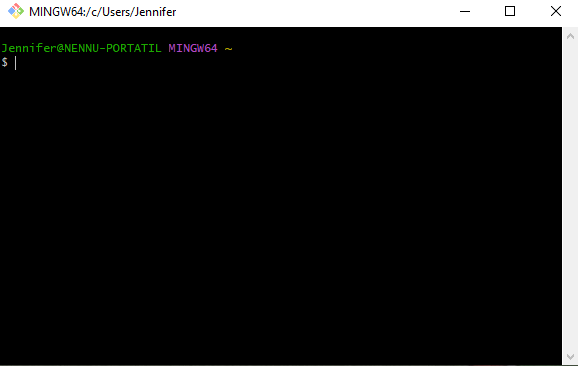
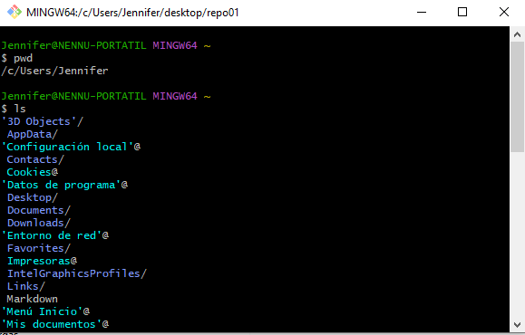
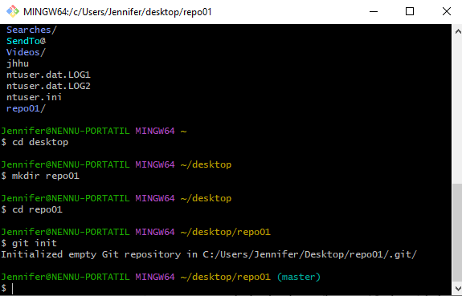
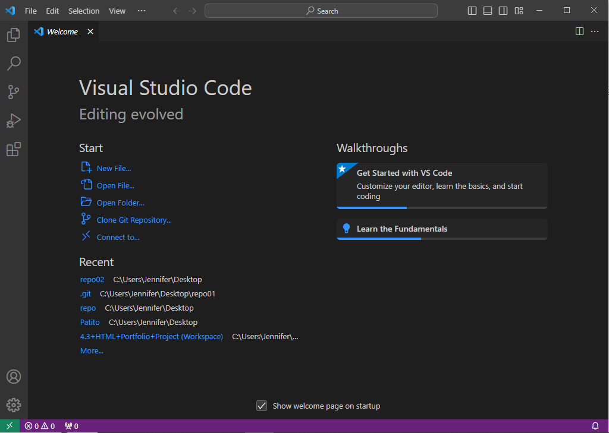
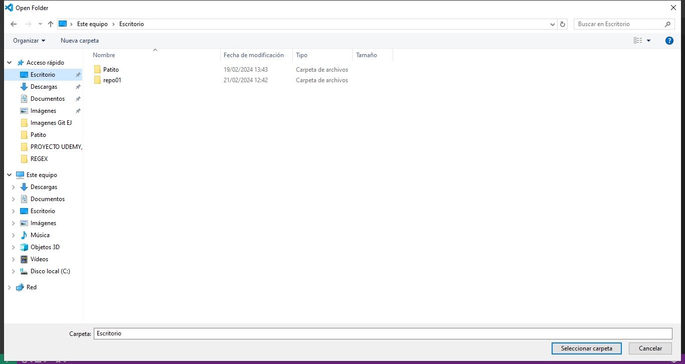
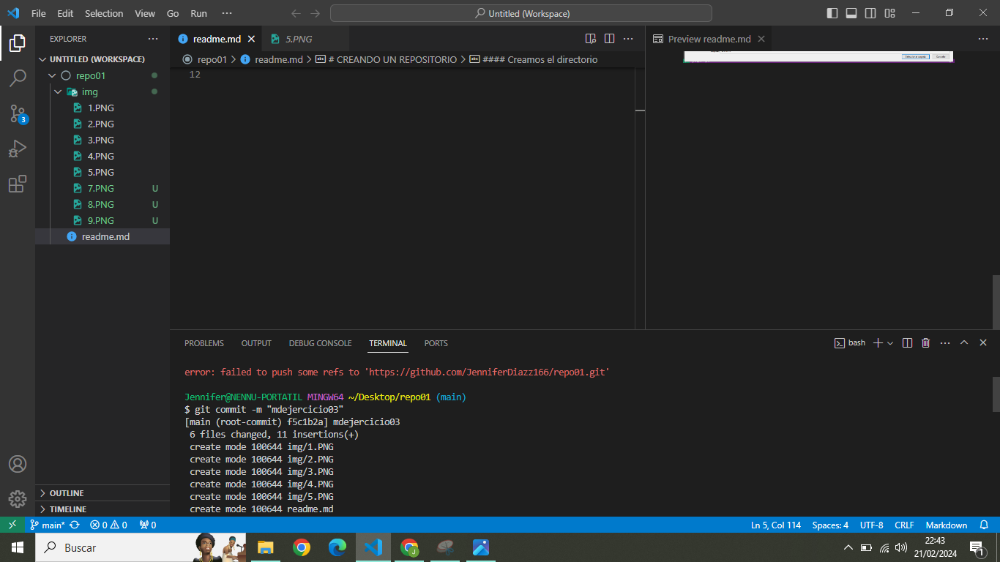
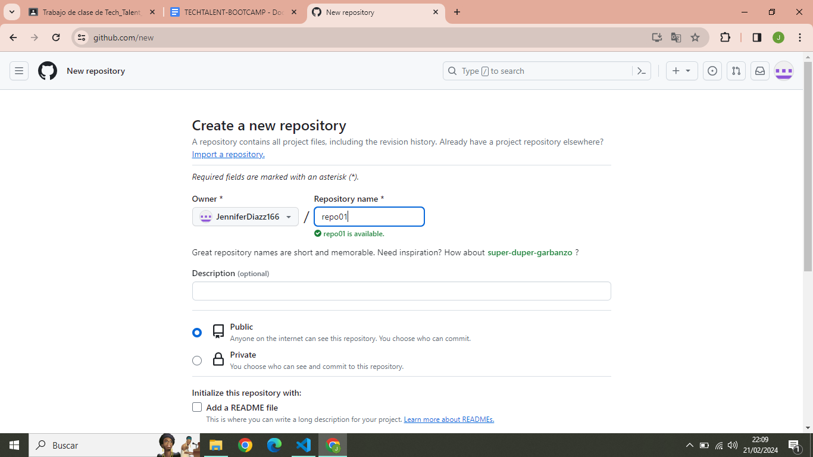
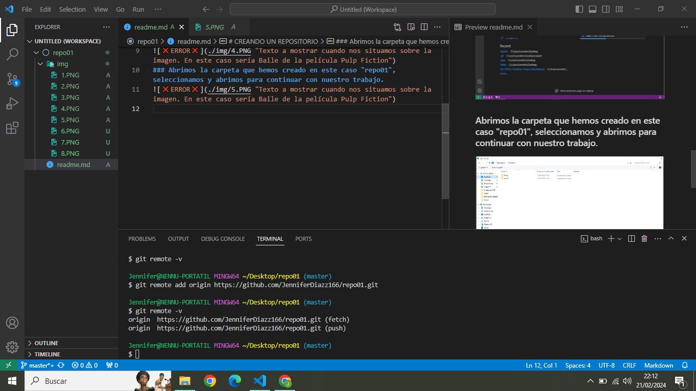

# EJERCICIO 1
## CREANDO UN REPOSITORIO 
#### Abrimos Git Bash

#### Creamos el directorio

### Creamos un repositorio

### Abrimos Visual Studio Code

### Abrimos la carpeta que hemos creado en este caso "repo01", seleccionamos y abrimos para continuar con nuestro trabajo. 

### Haz un snapshot (commit) del fichero hacía nuestro repositorio local.

## 1ra pregunta: 
### ¿En que "file status lifecycle" se encuentra el fichero?
#### Se encuentra en el último estado; en Commit.
## 2da pregunta:
### ¿Se te ocurre qué está pasando?
#### Sí, no tenemos el destino hecho. Por eso no sale.
### Crea un repositorio remoto llamado repo01, asócialo a tu repositorio local

### Vuelve a ejecutar el comando git remote –v

## 3ra pregunta:
### Explica el porqué ahora aparece.
#### Aparece porque ya hemos realizado el destino que queremos.

